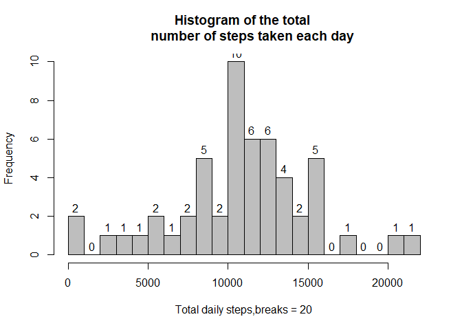

##Packages installation and attaching

```r
library(tidyverse)
library(mlr)
library(egg)
library(knitr)
```
## Loading and preprocessing the data

```r
download.file("https://d396qusza40orc.cloudfront.net/repdata%2Fdata%2Factivity.zip",
              destfile ="activity.zip", method = "wininet",quiet = FALSE,
              mode = "wb",cacheOK = FALSE)
unzip(zipfile = "activity.zip",list = FALSE,overwrite = TRUE,unzip = "internal")

activity <- read.csv(file = "activity.csv",header = T,fill = F)
activity1 <- na.omit(as.data.frame(activity))
```
## What is mean total number of steps taken per day?

```r
sbd <- activity1 %>% group_by(date) %>% summarise(Stepperday = sum(steps))
sbd1 <- as.data.frame(sbd)
hist(sbd1$Stepperday,xlab = "Total daily steps,breaks = 20",main="Histogram of the total 
     number of steps taken each day",breaks = 20, col = "grey", labels = T)
```

<!-- -->
 

```r
cat("The Mean of daily steps taken =", mean(sbd1$Stepperday))
```

```
## The Mean of daily steps taken = 10766.19
```

```r
cat("The Median of daily steps taken =", median(sbd1$Stepperday))
```

```
## The Median of daily steps taken = 10765
```

## What is the average daily activity pattern?

```r
sbi <- activity1 %>% group_by(interval) %>% summarise(aspi = mean(steps))
ggplot(sbi,aes(interval,aspi))+geom_line(color = "blue",size = 0.5)+ xlab("Interval")+
  ylab("Average Number of Steps")+ggtitle("Average Number of Steps per Interval")
```

<!-- -->

```r
mas <- filter(sbi,sbi$aspi == max(sbi$aspi))
mas1 <- as.data.frame(mas)
cat("The 5-minutes interval which contains the maximum number of steps is",mas1$interval,
    "\bth interval.")
```

```
## The 5-minutes interval which contains the maximum number of steps is 835 th interval.
```

```r
misv <- sum(is.na(activity$steps))
cat("The total number of missing values in the dataset are",misv)
```

```
## The total number of missing values in the dataset are 2304
```

## Imputing missing values

```r
activity2 <- split(activity, activity$interval)
activity2 <- lapply(activity2, function(x) {
  x$steps[which(is.na(x$steps))] <- mean(x$steps, na.rm = TRUE)
  return(x)
})
activity2 <- do.call("rbind", activity2)
row.names(activity2) <- NULL
activity2 <- split(activity2, activity2$date)
df <- lapply(activity2, function(x) {
  x$steps[which(is.na(x$steps))] <- mean(x$steps, na.rm = TRUE)
  return(x)
})
activity2 <- do.call("rbind", activity2)
row.names(activity2) <- NULL

sbd2 <- activity2 %>% group_by(date) %>% summarise(Stepperday = sum(steps))
sbd3 <- as.data.frame(sbd2)
hist(sbd3$Stepperday,xlab = "Total daily steps,breaks = 20",main="Histogram of the total 
     number of steps taken each day",breaks = 20, col = "violet",labels = T)
```

<!-- -->


```r
cat("The Mean of daily steps taken =", mean(sbd3$Stepperday))
```

```
## The Mean of daily steps taken = 10766.19
```

```r
cat("The Median of daily steps taken =", median(sbd3$Stepperday))
```

```
## The Median of daily steps taken = 10766.19
```

```r
summary(sbd$Stepperday)
```

```
##    Min. 1st Qu.  Median    Mean 3rd Qu.    Max. 
##      41    8841   10765   10766   13294   21194
```

```r
summary(sbd3$Stepperday)
```

```
##    Min. 1st Qu.  Median    Mean 3rd Qu.    Max. 
##      41    9819   10766   10766   12811   21194
```

```r
cat("It seems after imputing missing values Minimum value, Maximum value and Mean remain 
    unchanged, 1st quartile value and Median increased but 3rd quartile value decreased.")
```

```
## It seems after imputing missing values Minimum value, Maximum value and Mean remain 
##     unchanged, 1st quartile value and Median increased but 3rd quartile value decreased.
```

```r
p1 <- ggplot(sbd1,aes(sbd1$Stepperday)) + geom_histogram(bins = 20,col = "black",
      fill = "green") + stat_bin(bins = 20,aes(y=..count.., label=..count..),
                                              geom="text", vjust= -0.5)+
      xlab("Total daily steps,breaks = 20") +
      ggtitle("Hisgram of total daily steps with missing values")

p2 <- ggplot(sbd3,aes(sbd3$Stepperday)) + geom_histogram(bins = 20, col = "black",
      fill = "blue") + stat_bin(bins = 20, aes(y=..count.., label=..count..),
                                            geom="text", vjust= -0.5)+
      xlab("Total daily steps,breaks = 20") + 
      ggtitle("Hisgram of total daily steps with filled missing values")

ggarrange(p1,p2)
```

<!-- -->

```r
cat("From the above plot it is clear that total daily steps increased only on few cases 
    after imputing missing values as a number >=0 has been imputed on raw data.")
```

```
## From the above plot it is clear that total daily steps increased only on few cases 
##     after imputing missing values as a number >=0 has been imputed on raw data.
```

## Are there differences in activity patterns between weekdays and weekends?

```r
activity2$date <- as.Date(strptime(activity2$date, format="%Y-%m-%d"))
activity2$daytype <- sapply(activity2$date, function(x) {
  if (weekdays(x) == "Friday" | weekdays(x) =="Saturday") 
  {y <- "Weekend"} else 
  {y <- "Weekday"}
  y
})
activity3 <- as.data.frame(activity2)
activity4 <- aggregate(steps~interval + daytype, activity3, mean, na.rm = TRUE)

p3 <- ggplot(activity4, aes(x = interval , y = steps, color = daytype)) +
  geom_line() + labs(title = "Average daily steps by type of day", x = "Interval", y = 
         "Average number of steps") + facet_wrap(~daytype, ncol = 1, nrow=2)

plot(p3)
```

<!-- -->
